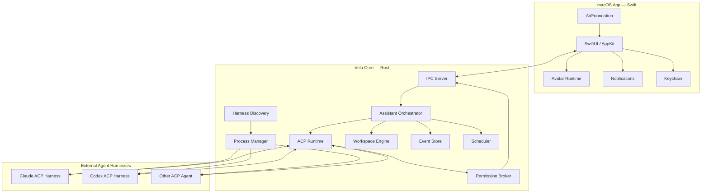
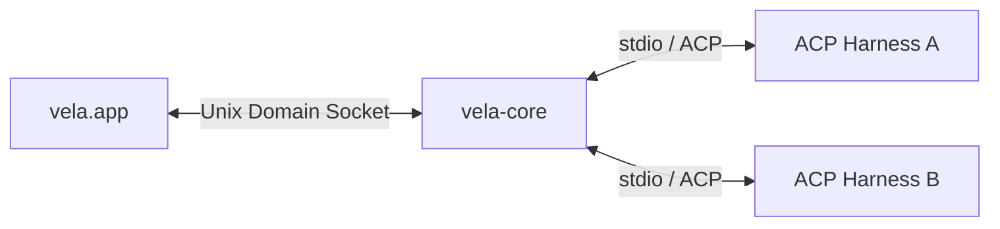
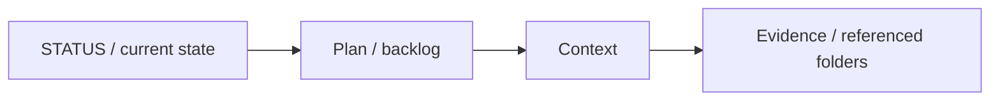
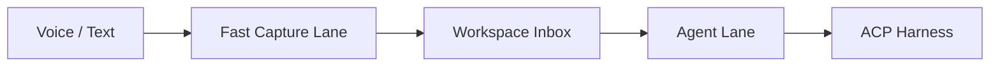

# Vela Architecture

## 1. Product Boundary

Vela is a persistent local-first work companion for macOS. Its core responsibility is to maintain useful work state and coordinate external agent runtimes, not to replace those runtimes.

The architecture separates four concerns:

1. **Native experience** — macOS windows, menu bar, hotkeys, audio, notifications, avatar rendering.
2. **Assistant core** — orchestration, workspace state, events, scheduling, discovery, permissions.
3. **Agent execution** — ACP-compatible external harnesses such as Claude Code and Codex adapters.
4. **Durable context** — human-readable workspace files plus structured indexes and event history.

## 2. System Overview



## 3. Stable Domain Contracts

Vela should not expose ACP wire types directly to the UI or workspace domain. ACP remains an adapter behind normalized contracts.

### Agent

```text
AgentDescriptor
- id
- display_name
- status
- capabilities
- launch_spec

AgentSession
- id
- agent_id
- workspace_id
- external_session_id?
- lifecycle_state

AgentEvent
- TextDelta
- PlanUpdated
- ToolStarted
- ToolFinished
- PermissionRequested
- UsageUpdated
- Completed
- Failed
```

### Workspace

```text
Workspace
- owned root
- referenced folders
- current work state
- inbox
- tasks
- notes
- project contexts
```

### Provenance

Every derived or mutated work item should be able to identify its origin:

```text
user_input | agent_inference | tool_result | scheduled_job | filesystem_change
```

## 4. Process Model

Vela Core runs as a sidecar process launched and supervised by the macOS application.



Reasons for a process boundary instead of direct FFI:

- ACP and agent streams are naturally asynchronous and long-lived.
- Core crashes can be isolated from the native UI.
- The core can be tested headlessly.
- Process supervision and harness management remain in one runtime.
- Future CLI/test clients can reuse the same core protocol.

## 5. IPC Boundary

Initial transport:

- Unix Domain Socket
- newline-delimited JSON or framed JSON messages
- request/response IDs
- server-pushed events
- explicit cancellation

The schema belongs to Vela, not ACP.

Example request:

```json
{
  "id": "req-1",
  "method": "session.prompt",
  "params": {
    "session_id": "session-1",
    "content": "What should I work on next?"
  }
}
```

Example event:

```json
{
  "event": "agent.text_delta",
  "data": {
    "session_id": "session-1",
    "text": "Start with..."
  }
}
```

## 6. ACP and Harness Boundary

Vela discovers local tooling and compatible ACP adapters, then normalizes them into `AgentDescriptor` instances.

Discovery is layered:

1. known built-in harness definitions;
2. CLI detection from PATH and known install locations;
3. user-defined ACP harness configuration.

Authentication remains owned by the underlying CLI/harness whenever possible. Vela should not parse private CLI credential stores to infer login state.

## 7. Permission Boundary

Agent-side requests that can mutate state or access sensitive resources must flow through a Vela permission broker.

Session readiness is also a security boundary. Each adapter launch spec declares an enforced ACP session mode. Core verifies the mode is advertised and successfully applies it immediately after `session/new`; otherwise session creation fails before the first prompt. Built-in child-process policy supplies a provider-specific defense-in-depth baseline, while permission decisions and audit semantics remain provider-neutral Vela contracts.

Minimum user decisions:

- Allow once
- Allow for session
- Deny

Later policy may add workspace-scoped persistent grants.

Permission requests and outcomes are observable events.

## 8. Workspace Model

The workspace is local-first and human-readable.

```text
workspace/
├── STATUS.md
├── INBOX.md
├── projects/
├── tasks/
├── notes/
├── context/
├── decisions/
└── evidence/
```

Referenced folders remain external; Vela stores references and access metadata instead of copying their contents.

SQLite is not the canonical work-state store. It is used for:

- event history;
- session metadata;
- search/index data;
- referenced-folder metadata;
- schedules;
- caches.

## 9. Progressive Context Disclosure

Agents should receive the smallest sufficient context first.



Expansion should be demand-driven rather than preloading an entire workspace into every prompt.

## 10. Capture Pipeline

Capture and deep reasoning are separate lanes.



The capture lane may perform deterministic or lightweight processing such as transcription cleanup, classification, and metadata extraction. Heavyweight agent sessions are used only when reasoning or execution is needed.

## 11. Avatar Boundary

The UI depends on a Vela-owned `AvatarRuntime` abstraction rather than renderer-specific types.

```text
AvatarRuntime
- load
- unload
- setState
- setExpression
- playMotion
- setLipSync
- lookAt
```

The domain communicates semantic states such as `idle`, `listening`, `thinking`, `speaking`, `success`, and `error`. The renderer decides how a state becomes an expression or motion; the contract carries semantic states and normalized values only, never a renderer's parameter, input, or file names.

The first adapter is Rive. A Live2D adapter is an intended second consumer, reached through a `WKWebView` rather than the native C++ SDK, and that second consumer is why renderer vocabulary must stay inside the adapter and its configuration block. Semantic state is derived in Swift from signals the app already publishes, so an avatar defect cannot reach Core, capture, or ACP. See [`plan/07-avatar-presence.md`](../plan/07-avatar-presence.md).

## 12. Observability

Core operations should emit structured diagnostics with correlation IDs for:

- IPC requests;
- ACP sessions;
- process lifecycle;
- permissions;
- workspace changes;
- scheduled jobs;
- failures and recovery.

A fake ACP harness is a first-class test dependency so CI can deterministically exercise streaming, cancellation, permission requests, failures, and recovery without real provider accounts.
