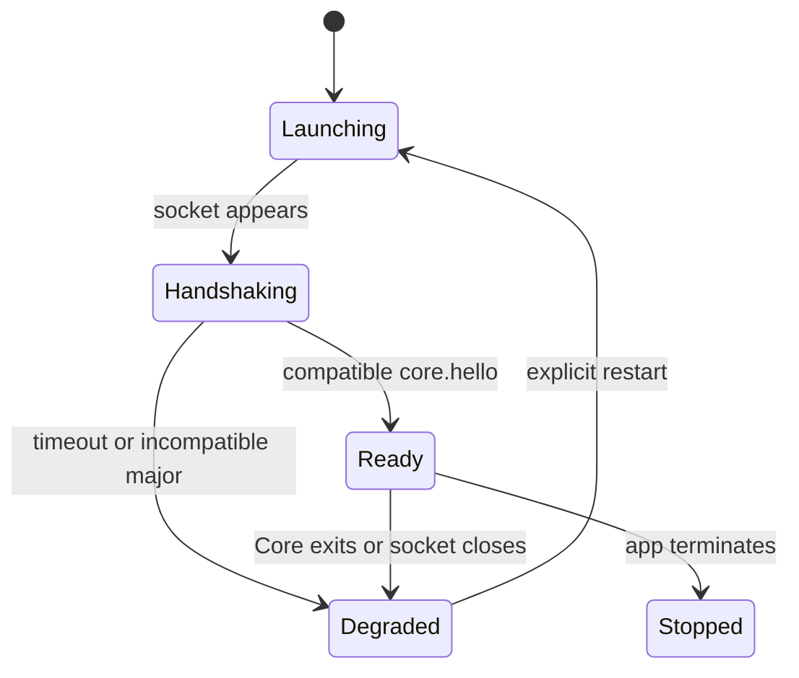

# Core IPC Lifecycle

Phase 01 uses an explicit-restart policy. The app never hides a Core failure by immediately replacing the process; it presents the degraded state and retains the exit/connection diagnostic. The user can then restart from the diagnostics screen without relaunching Vela.

Core readiness is the creation of its configured Unix socket. IPC readiness additionally requires a successful `core.hello` response with a compatible major version. A five-second launch timeout terminates the child and surfaces a diagnostic.

Each stream request owns a request ID. Ordered pushed events retain that ID until exactly one `stream.completed` or `stream.cancelled` terminal event. The Swift client rejects later events for a terminal request.

Development executable discovery order is:

1. `VELA_CORE_PATH`;
2. an executable next to or inside the app bundle;
3. `core/target/debug/vela-core` relative to the current working directory or its parent.
