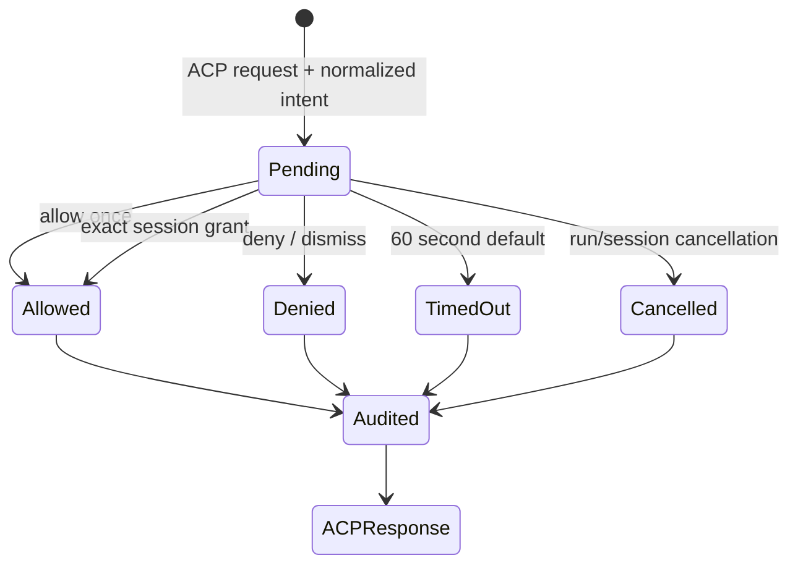

# Permission Broker

Phase 04 keeps permission policy in Vela while ACP wire options remain inside `acp-runtime`.



## Categories and context

Vela normalizes ACP tool-call context into `filesystem.read`, `filesystem.write`, `shell.execute`, `network.open_url`, `mcp.invoke`, or `other`. A request includes its Vela permission ID, agent/session/run/request IDs, tool-call ID, title, optional target, offered options, and expiry. Raw provider input is not copied wholesale into IPC or audit history.

## Decisions and safe defaults

- `Allow once` requires and selects ACP `allow_once` for only the current request.
- `Allow for session` stores an exact `(session, category, title, target)` Vela grant. Each later match still selects ACP `allow_once`; Vela never maps this decision to provider-wide `allow_always`.
- `Deny` selects `reject_once` when available. If no safely scoped reject option exists, Vela returns ACP `cancelled`.
- `Dismiss / Deny` in the native queue is an explicit deny. A disconnected or abandoned request times out after 60 seconds and returns ACP `cancelled`.
- Run cancellation resolves that run's pending requests; session shutdown additionally deletes every session grant.

Permission IDs are unique and stored independently, so requests from concurrent sessions cannot overwrite one another. Resolution requires matching permission, session, and run IDs. Duplicate, stale, or mismatched decisions do not change state.

## Audit example

```json
{
  "request": {
    "id": "permission-123-1",
    "agent_id": "codex",
    "session_id": "session-123-1",
    "run_id": "run-123-2",
    "request_id": "prompt-1",
    "tool_call_id": "tool-1",
    "category": "filesystem.write",
    "title": "Write file",
    "target": "/tmp/example.txt"
  },
  "decision": "allow_once",
  "status": "allowed",
  "source": "user",
  "selected_option_id": "allow-once",
  "resolved_at_ms": 1787665590000
}
```

Audit records are available through `permissions.history` and are also emitted as normalized `permission_resolved` agent events.

## Validation

The fake ACP harness covers all six categories, allow once, deny, exact session grants, timeout, cancellation, and two sessions pending concurrently. The Swift↔Rust integration test creates a fake permission session, resolves it through IPC, observes its audit record, and reaches one terminal event.

Real smoke attempts on 2026-08-25 used `codex-acp` 1.6.2 and `claude-agent-acp` 0.70.0. Their inherited policies performed harmless `/private/tmp` file calls without sending ACP permission requests. A test-only Codex `agent` / `on-request` / `workspace-write` retry also produced no request because `/private/tmp` remained an allowed root. A riskier outside-workspace write was deliberately not attempted. Real mediation is therefore unverified for these configurations and is not counted as broker evidence; Phase 05 remains gated on an isolated real-provider proof.
