# Vela Delivery Plan

This directory defines the implementation path as independently testable milestones. The ordering is intentional: each phase removes a concrete architectural or product risk before the next layer is introduced.

## Planning Rules

Every milestone must contain:

- a narrow hypothesis to validate;
- explicit scope and non-goals;
- a demonstrable deliverable;
- acceptance criteria that can be tested locally or in CI;
- observability sufficient to diagnose failure;
- an exit decision: proceed, revise, or stop.

A milestone is complete only when its acceptance criteria pass and the resulting slice can be exercised without relying on unfinished future phases.

## Execution Order

| Phase | Goal | Primary Risk Removed | Deliverable |
|---|---|---|---|
| 00 | Foundation | Repo/tooling ambiguity | Buildable Swift/Rust skeleton + diagnostics |
| 01 | Core IPC | Cross-runtime communication | Bidirectional Swift ↔ Rust streaming slice |
| 02 | Harness Discovery | Local agent detectability | Normalized Claude/Codex harness registry |
| 03 | ACP Session | Agent runtime integration | Prompt/stream/cancel/recover end to end |
| 04 | Permission Broker | Safe execution control | Native permission flow for ACP requests |
| 04.1 | Real Adapter Enforcement | Ambient provider policy bypass | Fail-closed ACP modes + real write-denial proof |
| 05 | Workspace | Persistent work-state model | Filesystem workspace + events + indexing |
| 06 | Capture | Daily utility | Text + push-to-talk capture into workspace |
| 07 | Avatar Presence | Presence/engagement | Semantic agent state → avatar reactions |
| 08 | Scheduled Assistance | Proactive utility | Scheduled work-state summaries/notifications |
| 09 | Dogfood & Distribution | Operational reliability | Diagnostics, compatibility, signing/update path |

## Dependency Flow

```mermaid
flowchart LR
    P00[00 Foundation]
    P01[01 Core IPC]
    P02[02 Harness Discovery]
    P03[03 ACP Session]
    P04[04 Permission Broker]
    P041[04.1 Real Adapter Enforcement]
    P05[05 Workspace]
    P06[06 Capture]
    P07[07 Avatar Presence]
    P08[08 Scheduled Assistance]
    P09[09 Dogfood & Distribution]

    P00 --> P01 --> P02 --> P03 --> P04 --> P041 --> P05 --> P06 --> P07 --> P08 --> P09
```

## Product Validation Gates

The technical milestones eventually feed three product-level validations:

### Gate A — Execution Plane

After Phase 04, answer:

> Can Vela reliably discover, control, observe, and safely mediate a local ACP-compatible agent runtime?

If not, do not invest further in product surface area.

### Gate B — Work Utility

After Phase 06, answer:

> Does Vela materially reduce capture friction and maintain a useful representation of current work state?

Measure actual dogfood usage rather than feature count.

### Gate C — Persistent Presence

After Phase 08, answer:

> Do avatar presence and scheduled assistance increase useful engagement without becoming distracting?

Presence features should be justified by observed utility, not novelty.

## Target MVP Success Signals

Initial dogfood targets:

- capture interaction can be completed in a few seconds;
- current work state is understandable without reconstructing chat history;
- Vela can answer what is active, blocked, and next from workspace state;
- ACP sessions can survive normal cancellation, harness exit, and reconnect scenarios;
- user-visible mutations and agent actions have traceable provenance;
- the user does not need to manually maintain duplicate state in Vela and external project folders.

## Milestone Files

- [`00-foundation.md`](00-foundation.md)
- [`01-core-ipc.md`](01-core-ipc.md)
- [`02-harness-discovery.md`](02-harness-discovery.md)
- [`03-acp-session.md`](03-acp-session.md)
- [`04-permission-broker.md`](04-permission-broker.md)
- [`04.1-real-adapter-enforcement.md`](04.1-real-adapter-enforcement.md)
- [`05-workspace.md`](05-workspace.md)
- [`06-capture.md`](06-capture.md)
- [`07-avatar-presence.md`](07-avatar-presence.md)
- [`08-scheduled-assistance.md`](08-scheduled-assistance.md)
- [`09-dogfood-distribution.md`](09-dogfood-distribution.md)
